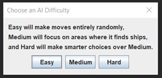
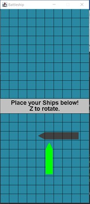
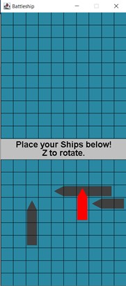
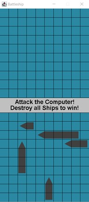
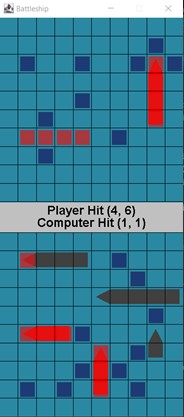
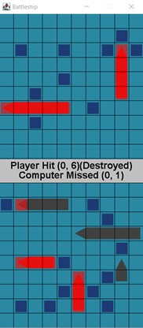
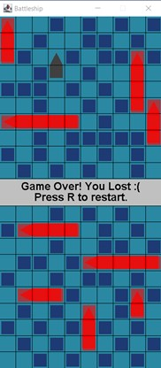
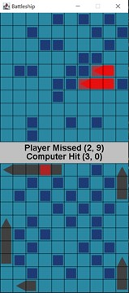

# 1.1 Battleship Game Clone Overview

**Overview written by Peter Mitchell.**

## Contents

```
1.1 Battleship Game Clone Overview
1.2 Introduction
1.3 The Rules of Battleship
1.4 High Level Discussion About Implementation
1.5 How the Core Game Works
1.6 Features You Could Add
```
# 1.2 Introduction

This document will explain the fundamentals of how the Battleship game works.

- ([Youtube Demo](https://youtu.be/BaLBZEwchQY))

# 1.3 The Rules of Battleship

Battleship has a simple set of rules that create an enjoyable game through trying to find an opponent’s
ships before they find yours. The rules can be summarised as follow.

- Each player begins with a 10x10 grid and place 5 ships on their grid. All ships are 1 unit wide,
    and with lengths of 5, 4, 3, 3, and 2. These ships can be placed either horizontally or vertically.
- The game starts with the player and their opponent not knowing where the opponent’s ships
    are.
- After the preparation stage of placing ships the game alternates between players allowing
    them to select one new position on the opponent’s grid that has not yet been attacked.
- The positions are marked once they have been attacked, either with a blue marker indicating
    it was a miss in open water, or a red marker indicating a ship was hit.
- Once a ship has been destroyed from all grid positions having been hit, the ship is revealed as
    destroyed to the other player.
- The game ends when all ships for either player’s side have been destroyed. The winner is the
    player with ships still not destroyed.


# 1.4 High Level Discussion About Implementation

The chosen implementation of Battleship for this example game has included multiple levels of AI to
make it a single played game. When the game begins the dialog shown below appears before the main
game opens to allow selection of the difficulty.



The Easy AI will choose every move entirely randomly. The medium AI will choose random moves
unless it has hit a ship that is not yet destroyed. It will attack random adjacent cells to the found hit
location until the ship is destroyed. The hard AI will choose moves by considering the number of
adjacent cells, and when it finds a ship, it will try to form a line of hit cells instead of choosing adjacent
selection randomly.

  

Once the game is open the player enters their ship placement phase. You can see in the above three
images the progress through placing ships. In the first image one ship has been placed, and another
ship is about to be placed. The green colour indicates the placement is valid. Using the left mouse
button to click would place the ship. The middle panel shows the ship being placed as red. This
indicates that the placement is not valid because it intersects another existing ship. Once all ships have
been placed the image shown in the last panel will indicate the state has changed to allow attacking
of the enemy. The player can then click in the top grid to make attacks.

Clicking on each cell will mark the cell as either a hit or a miss (red or blue respectively). Once a ship
is destroyed it will show the full ship as red behind the red markers. Once all the ships on one grid
have been destroyed either the player will have won, or the computer will have won. This is shown as
seen in the image below on the right.

  

The controls can be summarised as the following.

- At any time:
    o Escape to quit.
    o R to restart.
    o D to activate debug mode to cheat and view the opponent’s ships.
- During Placement Phase:
    o Click to place ship (only places the ship if it is a valid placement).
    o Z to rotate between vertical and horizontal for placement.
- During Attack Phase:
    o Click on the enemy’s grid in places that have not yet been marked to reveal the
       squares as hits or misses.


# 1.5 How the Core Game Works

This section will briefly describe the purpose of each class in the structure. It will not cover in detail all
the methods that are included in each method. You can view the code to browse the in-depth
comments to understand how each element has been created.

Representing the Grid:

- Marker: Represents the coloured red or blue markers that show up when attacking on the
    grid. All 10x10 of these are created at the start and drawn if they have been marked. They
    keep track of the ship they would represent hitting to allow the AI to get the information.
- Position: Used to represent a position with an x and y coordinate mostly for indicating the grid
    coordinates, but in many cases also to represent pixel offsets for drawing.
- Rectangle: Used to represent a generic rectangle with a top corner, width, and height with
    collision detection against a single point.
- SelectionGrid: The actual grid that contains a collection of markers, ships, and draws these
    with a set of lines to show where cells are. Includes appropriate methods to manage the state
    of the grid.
- Ship: Defines a ship that keeps track of where it is located on the grid and should be drawn.
    The ship can also track whether it has been destroyed to notify other classes when asked.

High level interface:

- Game: Creates the JFrame to contain the GamePanel and manages collection of the keyboard
    input.
- GamePanel: Controls the two selection grids for the players and manages all the player
    interaction with their grid. Controls all the information necessary to manage the game state.
- StatusPanel: Represents the text panel in the middle between the two selection grids.

AI:

- BattleshipAI: Defines the template with methods for the other classes to override. This does
    not do anything useful by itself.
- SimpleRandomAI: Defines the Easy difficulty AI that takes the list of valid moves, randomises
    the order of the moves, and then selects the first option.
- SmarterAI: Defines the Medium and Hard difficulty AIs. Medium AI is activated by leaving the
    two parameters false. Hard AI is activated by setting the two parameters to true. You could
    have difficulties between these two by activating just one of the two parameters. The main
    thing that the smarter AI does is that it will focus in the area around where it finds a ship hit.
    The medium AI will just choose random adjacent positions, and otherwise randomly select
    any valid move. The hard AI with preferMovesFormingLine active will try to form lines with
    moves once it find a ship hit, this improves the chance of adjacent selections to also be a hit.
    The hard AI with maximiseAdjacentRandomisation active will change behaviour while
    selecting moves when there is no recent ship hit. It will search for the valid move with the
    highest number of unmarked adjacent cells.


# 1.6 Features You Could Add

There are many small changes that could be made to modify the game as it currently is. The following
list summarises some of these possible changes.



- The hard AI does have flaws. Placing ships along the edges would
    exploit the way random valid moves are selected. They would
    only be found after selecting nearly half the cells in the central
    rectangle. An example of this is shown to the right. You can see
    that it only selected that first hit at (3, 0) after having reached
    the point that all central areas have 3 or less adjacent unmarked
    cells. One approach to making the AI even harder could be to let
    the AI cheat and detect if the player has put any ships on the
    edges and then use that information to increase the priority of
    selecting edge positions in some way. A similar issue can also
    occur when the last ship to be found is the ship that is only 2
    segments long. If all the grid positions have been marked around
    the 2 - segment ship it will not be found randomly until all
    adjacent cell counts fall reach 1. Fixing this specific issue would
    be difficult without significant cheating though.
- Create your own AI implementation. The examples of AI could be
    used to influence how you implement it.
- Improve the game interface. The interface is very simple
    currently. You could make the ships have images matching the
    types of ships and add more interesting UI elements.
- Try testing how the game changes by modifying the size of the grid, or by changing the number
    of or types of ships. You can change these by setting the GRID_WIDTH, GRID_HEIGHT, or
    BOAT_SIZES variables in SelectionGrid.
- Look at how other Battleship implementations have done things and add a feature they
    included.
- Come up with a feature of your own and implement it to improve the game.


